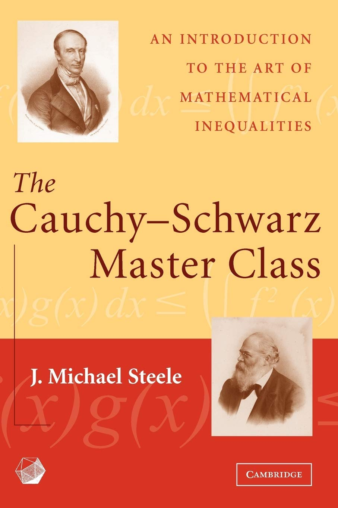

+++
title = "Doing proofs: The Cauchy-Schwarz Master Class"
date = "2023-03-20"
+++

My favorite instructive math book I have read till now is
the Cauchy-Schwarz Master Class written by Michael Steele et al.

<!-- more -->

Along the way the Cauchy-Schwarz inequality (obvious), ladder
of power means, Hölder/Hilbert/Hardy inequalities, but also
convexity arguments, Legendre transformation or Muirhead's inequality
are introduced.

The authors manage to present the topic in a fun way and use
algebraic and geometric arguments to show the beauty the field.
The material is well-structured and leads through a well-structured
chain of proofs. I never had so much fun in doing proofs, simple use
of permutations and convexity leading to the Muirhead inequality and
Schur's Majorization is quite an epiphany. The authors are clearly
inspired by The Book.

(Given a class in calculus) The book is a perfect introduction for
someone who wants to develop a love relationship to math. If I
had an instructor as a pupil my view of math would have been quite
different back then.

And it is of course useful for optimization introducing Jensen 
inequality, convex conjugates (and Hölder inequality), majorization 
and relationship between means in general.

To end an excerpt from the preface

> To solve a problem is a very human undertaking, and more than a little
> mystery remains about how we best guide ourselves to the discovery of
> original solutions. Still, as George Pólya and others have taught us, there
> are principles of problem solving. With practice and good coaching we
> can all improve our skills. Just like singers, actors, or pianists, we have a
> path toward a deeper mastery of our craft.

Click on the image to go to Steele's website

	

