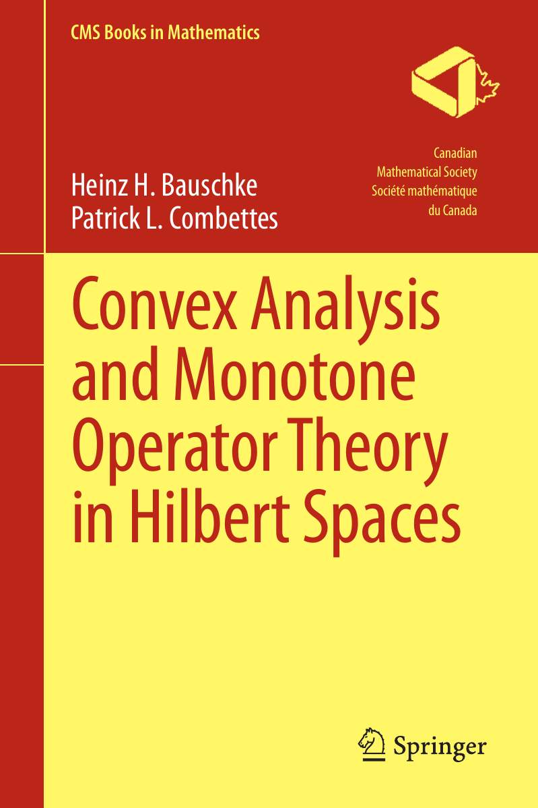

+++
title = "Solutions to Convex Analysis and Monotone Operator Theory book"
date = "2024-11-07"
+++

I recently started with some exercises of the comprehensive
convex analysis and monotone operator book by Bauschke and
Combettes. It is an excellent source for self-studying and 
a good fit for a student with EE math background.

<!-- more -->

I publish some of the solutions here to self-motivate myself 
to do more :grin: You can find the entry notes at

 - Chapter 6: <a href="https://zettel.haus/@losch/113565900543638181" target="_blank">https://zettel.haus/@losch/113565900543638181</a>
 - Chapter 9: <a href="https://zettel.haus/@losch/113673101128912899" target="_blank">https://zettel.haus/@losch/113673101128912899</a>
 - Chapter 12: <a href="https://zettel.haus/deck/@losch/113884926319419426" target="_blank">https://zettel.haus/deck/@losch/113884926319419426</a>

The book is written by [Heinz H. Bauschke](https://cmps-people.ok.ubc.ca/bauschke/) and [Patrick L. Combettes](https://pcombet.math.ncsu.edu/). You can click on the cover below to go the Springer website. But there may be some first edition available online.

---

---
