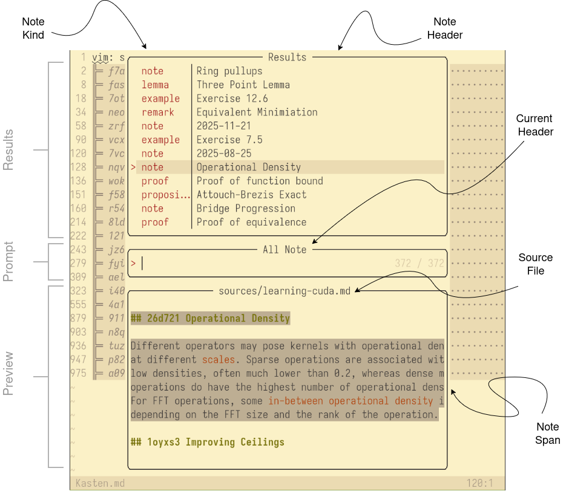

+++
title = "A Telescope picker for ZTL"
date = "2025-10-30"

[extra]
mailtoken = "djkl3j"

[[extra.readnext]]
title = "Writing notes like it's (almost) 2025"
url = "/notes"
desc = "I wrote a new iteration of my note system during a week vacation from home. Motivated with two recent observations, that the system I want to built is actually a static note generator, and that Mastodon is a good fit for publishing and reviewing notes, I created a tool called ztl."
via = "lorenzschmidt.com"
date = "10. November 2024"
+++

Navigating a set of notes is central for a useful note
taking system. I recently designed a custom note picker for
ZTL and aplied ideas of modal editing to its function.

<!-- more -->

The [Telescope](https://github.com/nvim-telescope/telescope.nvim) picker [^1] displays references associated 
with one note, a note list or all notes in the ***ZTL*** 
repository. It packs a lot of information in a small area,
provides a _result_ window for displaying list of potential notes, a
window for entering a _prompt_, to further subselect results,
and a _preview_ window for viewing information associated with
the note. As the notes are generated from either Markdown,
LaTeX or BibTeX (see [last post](https://lorenzschmidt.com/notes/#all-the-formats-i-need)), notes do have a type and
of course an associated header.

[^1]: Telescope provides a template to rapidly develope
    different forms of pickers. Their examples showcases
    among others file pickers, Git commit pickers, etc.

For example, the overlay looks like this when querying all
available notes:


    


Similar to Ariadne's thread the picker allows following
a chain of notes, until the desired one is located. Moving along
the chain is easy done with the `<Plug>ZtlFollow` and
`<Plug>ZtlRetreat` keymaps [^2]. (normally associated with arrow keys) 

[^2]: I use the `<Plug> Plugin Action` syntax from ViM to
    define custom keymaps and provide more context of their
    function. See the [:help using-\<Plug\>](https://vimhelp.org/usr_51.txt.html#using-%3CPlug%3E) help page for 
    further information.

At each position we can show either ***incoming***, ***outgoing*** links or 
the ***history*** of a note. Incoming links include parent
note, and those referencing us, outgoing links include all
children notes and links contained in the note content. The
history of a note displays all commits in the Git history
associated with changes to either the note content or
header. Their associated keymaps are
`<Plug>ZtlModeOutgoing`, `<Plug>ZtlModeIncoming` and
`<Plug>ZtlModeHistory`. 

For outgoing and history modes (incoming looks the same with
different arrows), the results window looks like this:


    


Following a commit in the repository brings up all notes
changed in that specific instance. I also borrowed the Git
commit previewer from the Telescope repository to show
change date, commit message and changed files with syntax
highlighting.

## Modal editing and actions depending on the initial mode

This becomes more powerful, when combining with the modal
editing approach of ViM to create custom actions for a
selected note.

In ViM jargon we support currently actions based on either 
the ***insert mode***, ***visual mode*** or ***normal mode***. For normal mode, 
we open selected note in current window, for insert mode, we
paste a new link at the current cursor position and jump to
fill in the link text, for visual mode we replace the
selected text with note. To give an example, here for visual
mode:

## Three previews for notes

Textual information is simple, we just display the range of
lines corresponding to a note. For showing the history of a
note, we parse the result of `git log` and display
associated commits, which changed a note.

For resources, the task is a bit more involved. We have to
take a snapshot of the resource at a given view. For this, I
have written an auxilliary binary called `ztl-res`. It does
all the heavy work of search and rendering views into
snippets, ready to display to terminals.

That looks currently like this, and allows to include views
in the generated links (with the help of [SIXEL](https://en.wikipedia.org/wiki/Sixel)):


    


## Conclusion

It is astonishing how rich the information is, you can be packed in a
pure textual information (plus some snippets) representation. The picker 
respresents all possible interactions with the set of notes.

That's all for now :) Next time I will write about scheduling in the 
ZTL system and managing long running cycles.
