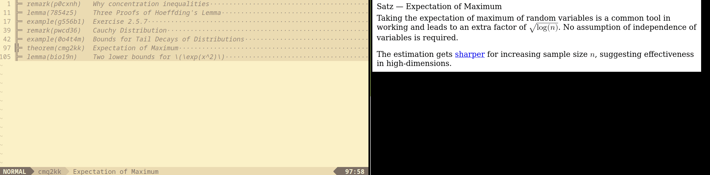
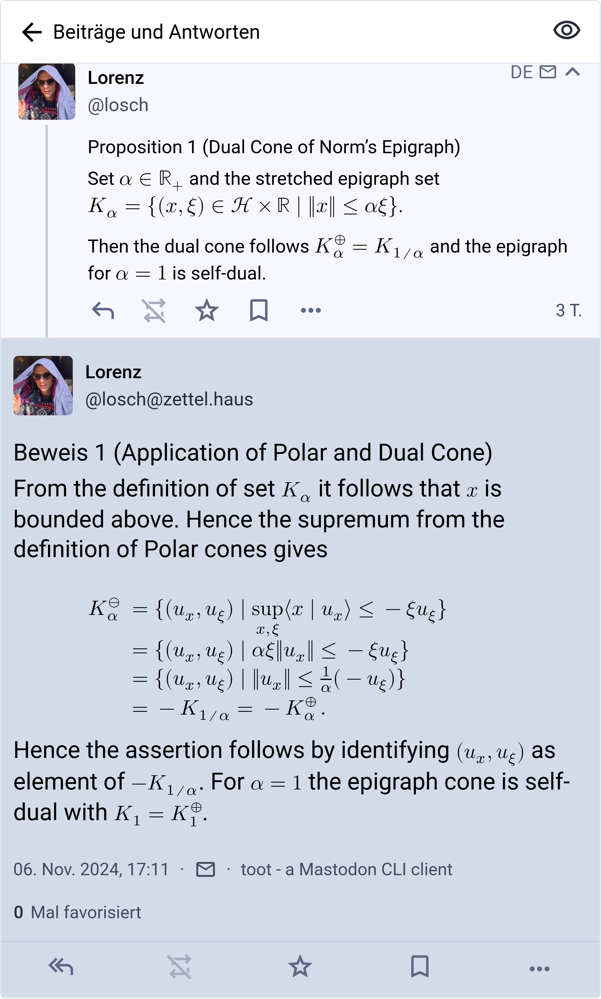

+++
title = "Writing notes like it's (almost) 2025"
date = "2024-11-10"
+++

I wrote a new iteration of my note system during a week vacation from home. Motivated with two recent observations, that the system I want to built is actually a static note generator, and that Mastodon is a good fit for publishing and reviewing notes, I created a tool called [ztl](https://github.com/bytesnake/ztl).

<!-- more -->

The website you're currently reading is generated with something called a static website generator, in this case the excellent [zola](https://www.getzola.org/) tool. Its main feature is that everything is compiled once into a set of static files, which can be served to the reader with a simple HTTP endpoint.

The equivalent for a note taking system is a static note generator. It takes a all files in a subfolder, generates linked notes from them and saves the artifact in a simple format (here [TOML](https://toml.io/en/)) for downstream use. The artifact has three characteristics, it is

**rendered** &ensp; the note content is rendered into a universal format, here HTML together with MathML for displaying formulae.

**linked** &ensp; from the artifact parent note, outgoing links and incoming links are readily available for navigating to relevant content

**spanned** &ensp; span for each source file provides an overlay we can use for editors to display inline information when viewing

I recently had a whole week vacation at home and built such a tool which can (1) render a folder into notes (2) do a live-preview of the content (3) publish them to a Mastodon instance

### All the formats I need

There are two modes of writing which are irreconcilable for me. The first I use for prose text, the second for scientific notation. As I'm comfortable with LaTeX and don't want to miss out on the `ams*` packages, I opted for markdown and LaTeX.

In side-by-side comparison the syntax for markdown,

```markdown
# tpawk9 Encoding for optimal retrieval practice

The initial encoding technique is important in retrieval practice. Connecting
the to-be-learned to already established [memory codes](k4e29j) gives a head-start
for any further spaced out retrieval practice sessions.

[...]

## nell5y Encoding in melody learning

For efficient melody learning, muscle, ear and cognitive capabilities are
possible strategies for encoding.

[...]
```
and the syntax for LaTeX with theorem blocks, custom commands and operators,

```latex
\begin{definition}[label=1k5i7v, name=Polar Cones]
    The polar \r{cone}{2zn8yr} is defined as
    \begin{align*}
        C^\ominus = \set{x\in\hilber}{\sup\innerp{C}{x} \leq 0}.
    \end{align*}

    \begin{theorem}[label=6af37y, name=Cones of Proximal Operators]
        % ...
    \end{theorem}
\end{definition}
```

Both versions highlight how to define two nested notes. In Markdown the ID and title are implicitely define by convention of the header, while in LaTeX they are made explicit through the key definitions of the blocks. Nesting is also implicitely defined in Markdown. If the header level is larger, then the note is defined as the child of the previous one. On the other hand, in LaTeX this is explicit by nesting two blocks in each other and having indentation for better readability.

Further linking to other notes is done with simple hyperrefs in markdown syntax, while in LaTeX I have a custom command `\r{<label>}{<target>}` for that.

The Markdown version is much easier to read and less poluted by special commands, while the LaTeX version is much more flexible with custom commands and mathematical notation. 

For conversion I use the [comrak](https://github.com/kivikakk/comrak) crate for Markdown, and the excellent [TeX4ht](https://tug.org/tex4ht/) for LaTeX. Before passing the note to each processor, I extract it from previous and following notes. This is especially important for LaTeX, as it makes the compilation process much faster.

As references can only point within a note set, I need a third file format for bibliography notes. Of course, I use the established `bibtex` and support a third file format with `*.bib`. BibTeX are currently not rendered to HTML and instead silently dropped when published to Mastodon. They support a `file` key though and additional metadata which is shown in Vim.

### Watching changes with Sixel characters

Because the LaTeX format is so complicated, I need live preview when writing notes.

The Sixel format defines an ASCII standard for printing graphics to terminal emulators. Many emulators are supporting this already, you can find a complete list at [Are we Sixel yet?](https://www.arewesixelyet.com/). I use a patches version of Alacritty.

Further, I recently found out that TMux also supports Sixel in their latest version. This is awesome, because it means I can create a split pane with editor on one side, live preview on the other side on a remote server. When I want to continue working on notes, I can just re-attach the session from any computer.

In total this looks like this (rendering with headless chromium)





### Toots and Notes

When reading things up, it would be great to have notes available on the browser or on smartphone. 

Because we already have rendered HTML in our compiled note set, publishing notes to Mastodon is simple. For [ztl](https://github.com/bytesnake/ztl) there is a subcommand `ztl publish`, which toots new notes, edits already existing if their content changed and deletes old notes on the Mastodon instance. Tooting is driven by the [toot](https://toot.bezdomni.net/introduction.html) Mastodon CLI tool.

To work properly I had to customize one instance with larger character size (HTML can be pretty long), and allow the [MathML tags](https://developer.mozilla.org/en-US/docs/Web/MathML/Element).

Mastodon fits nicely because

 * parent notes are just toots which we reply to and rendered in threading mode
 * memos can be attached to notes and collected with an apropriate hashtag
 * changes of toots are available and displayed similar like Git differences

In total, a threaded note view looks like this



### Comments on Rust

Rust is a natural fit for text processing command line tools. It is fast, expressive and has excellent tooling for development.

No suprise for used crates, I have [clap](https://github.com/clap-rs/clap) for argument parsing, use [serde](https://serde.rs/) for TOML processing and [anyhow](https://github.com/dtolnay/anyhow) for error wrapping. Further I used [scraper](https://docs.rs/scraper/latest/scraper/) for HTML post-processing and [comrak](https://github.com/kivikakk/comrak) for Markdown processing. The TeX4ht tools are directly called as an external binary, same for the Mastodon integration. The development process felt super straightforward and pretty rewarding for me.

Parsed note information has the [following structure](https://github.com/bytesnake/ztl/blob/main/src/notes.rs#L38) and are collected into `.ztl/cache/<key>` files in TOML format

```rust
#[derive(Debug, Serialize, Deserialize)]
pub(crate) struct Note {
    pub id: Key,
    pub header: String,
    pub parent: Option<Key>,
    pub outgoing: Vec<Outgoing>,
    pub incoming: Vec<Key>,
    pub html: String,
    pub span: Span,
    pub file: Option<String>,
    pub hash: String,
}
```

I will extend on the technical side a bit, once I found time to improve documentation of the repository.


### Wrapping up

In summary I'm very happy with the current iteration of `ztl`. It is persistent through terminal multiplexing, powerful enough to encode any content and simple enough that it can be extended in future iterations.

Futher, I can work through text with modal editing, while at the same time read on any computer or smartphone in this world.
