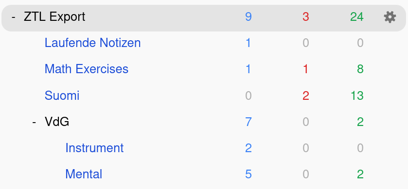
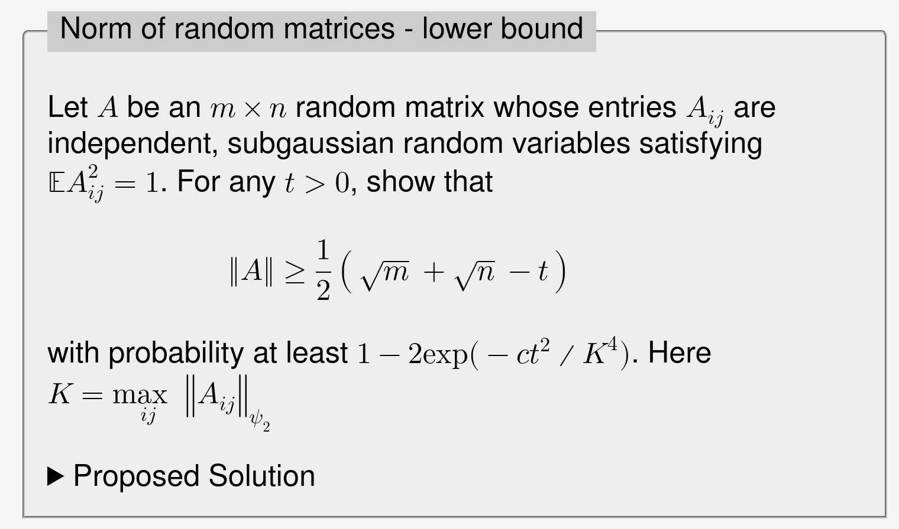
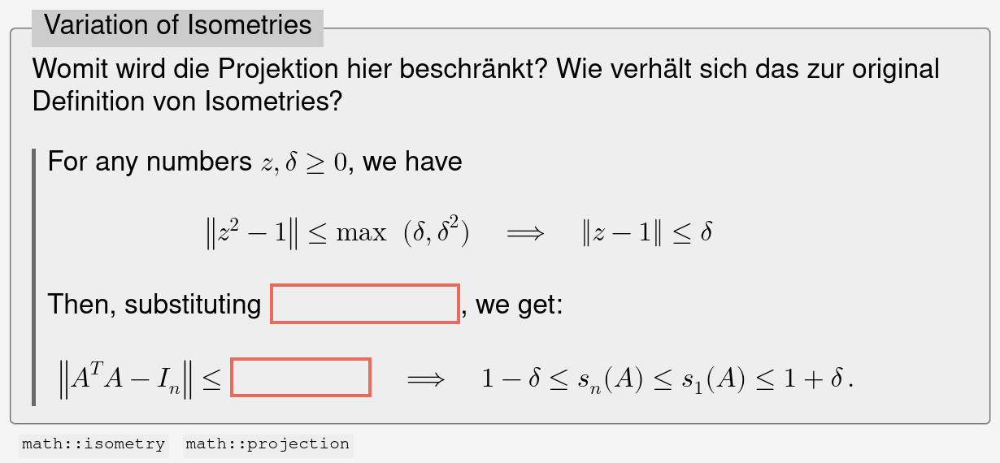

+++
title = "Recent observations from recall practice"
date = "2026-07-01"
+++

Unordered notes on recall practice from [ZTL](https://codeberg.org/losch/ztl)
exports. Topics are focus, tagging, math and physical learning and note-card
combinations.

<!-- more -->

## Tagging is great

Tagging[^1] provides more flexibility than rigid decks, whose topics are chosen 
beforehand. You can have overlapping groups, such as studying grammar for all 
languages or all card types of a single language. Furthermore, you can decide
to study a specific group from your pool of cards, cross decks and cross topics.

[^1]: Read the [ankiweb](https://docs.ankiweb.net/searching.html#tags-decks-cards-and-notes) to understand how you can create filtered decks from tags. In my case this looks like `(tag:ztl is:new) OR (tag:ztl is:due)` filtering for new and due cards. You can combine tag lenses with _OR_ patterns.

My current Anki decks looks like this:


    


## Anki provides focus

Learning programs, such as Anki or Supermemo, are effective because of
their spaced-repetition approach to review. Another powerful side-effect
I recently observed, it that they reduce distractions for me. I can open
the deck without having to go through the trouble of finding some text
and be visually distracted. And I only see content I have curated
beforehand, which is an important exercise in self-awareness.


    


## Postponing is a useful feature

I wasn't aware that you can "postpone"[^2] a card. If I'm stuck at a new
card or somehow cheated by looking up a partial solution, I will
just postpone until tomorrow. That sounds like an obvious thing, but it
gives my mind some time to forget or reorder the content.

[^2]: The shortkey for postponing is the `-` symbol.

Especially for my math exercises, I postpone until I come up with a
solution. Then I recall for 3-4 more cycles, and finally set my
solution to the outer note. This approach is quite heuristic, but
works well for me.

## Combining cards and notes is powerful

Embedding cards definition into the context of a note brings
additional information for rendering the card. My simplest
card class `wip` has no fields and just brings the note into
view:

```markdown
# i5w46d Beobachtungen eines Praktizierenden

1. Recognition ersetzt immer noch kein Recall

Etwas abzurufen ist der wichtige Schritt beim Lernen einer
Tätigkeit. Dies lässt sich durch bloßes (wieder) Erkennen nicht

[...]

<card class="wip" />
```

Another example is a note I want to recall with clozes attached. Then a simple:

```html
<card class="cloze" hide="d">
    <q>Why is the lower bound trivial?</q>
    <tags>math::operator-norm</tags>
</card>
```

generates clozes for the outer note


    



## Physical skill learning is still hard

Recently, I was inspired by [this](https://old.reddit.com/r/Anki/comments/xtjqly/has_anyone_used_anki_for_physical_skills_and_has/iqrqk6g/) reddit post about the role
of visualization in physical skill learning.

> I suggest making two identical decks: Salsa Mental and Salsa Physical.
>
> Use the mental deck to practice visualizing techniques. Create complete mental images of yourself doing the techniques to a salsa beat. By "complete" I mean don't just recall what the technique "looks like", visualize what every part of your body is doing.
> 
> Use the physical deck when you have the opportunity to physically practice. 

