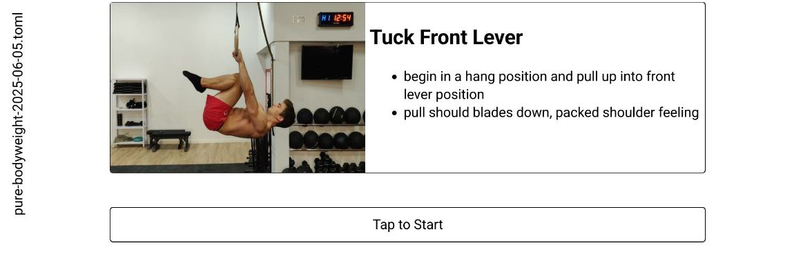
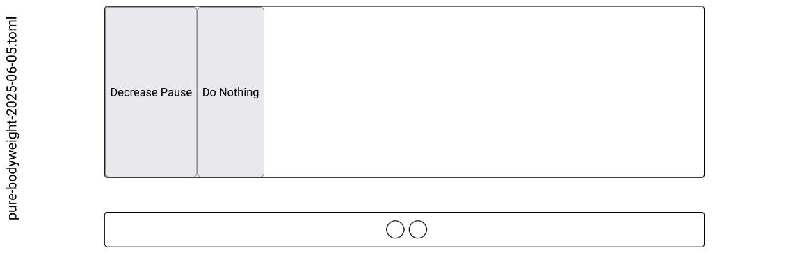

+++
title = "Self-modifying configuration pattern"
date = "2025-06-05"

[extra]
mailtoken = "j32oyb3"

[extra.changelog]
5402284 = { title="Add blog post about self-modifying pattern", date = "5 June, 2025" }

[[extra.readnext]]
title = "People actually do this for fun?"
url = "https://ginoz.bearblog.dev/people-actually-do-this-for-fun/"
desc = "Leaving my house is in the top three things I stopped doing since the pandemic began, almost five years ago."
via = "bearblog.dev"
date = "01 Sept, 2025"

+++

One of the interesting, and hard part, in calisthenic is the ability to progress between movements in [many different ways](https://docs.google.com/spreadsheets/d/1a8tlZ-zbF695HA3Lmm20OIYeYYxo1lmUOczUXKLoL4s/edit?gid=1833143925#gid=1833143925). I recently found myself in want of tracking exercise progressions long-term, and implemented a simple interval timer sourced from [TOML](https://toml.io/en/) files. For intra-exercise progressions, I found a self-modifying pattern useful, where the configuration keys can act on themselves.

<!-- more -->

To tailor the interval timer to my specific use and keep complexity low, I've written a small JS webapp, where you can upload a set of exercises of TOML files. It then executes them progressively and offers a progressed version at the end, for the next time.

For example, the Tuck Lever exercise does have a header of
```toml,name=https://github.com/getzola/zola/pull/2797
[tuck-front-lever]
tags = [ "bodyweight" ]
text = """
## Tuck Front Lever
 
 - begin in a hang position and pull up into front lever position
 - pull should blades down, packed shoulder feeling
"""
media = "https://workout-temple.com/wp-content/uploads/2022/11/sideview-tucked-front-lever.jpg"
```

Before the exercise starts:



A main design question is how to implement all the specific progression for exercises. Some consists of simple on-off phases, others have multi-stage exercises, again other progress in changing the movement altogether. To accommodate all of these possible progressions, I quickly realized that no built-in system would suffice.

Instead, I moved the programmatic part from the webapp to the configuration file, and described the possible progression actions as fields with associated JS snippets. The file acts on itself, is hence self-modifying. 
Again for the Tuck Front Lever, we have only a single action, that of decreasing pause between sets:

```toml
[tuck-front-lever.mods.decrease-pause]
name = "Decrease Pause"
action = """
for (const elm of cfg["config"]["conduct"]) {
\tif(elm["kind"] != "pause")
\t\tcontinue;

\telm["length"] *= 0.75;
}
"""
```

After the exercises ends, you can select whether to progress or not:



The link on the left downloads the modified file. Pretty simple and flexible.
