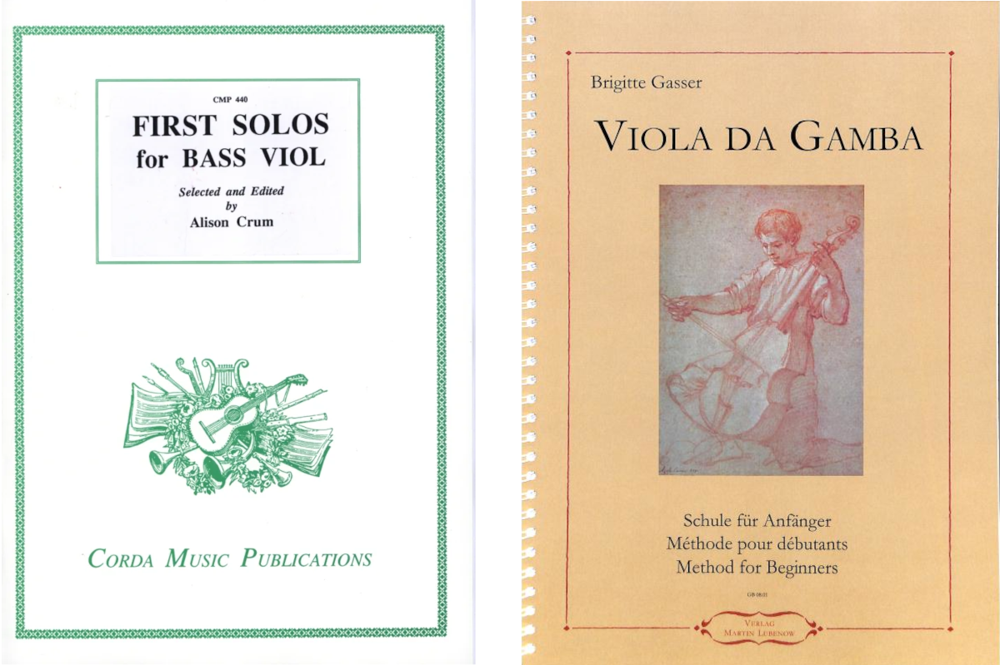

+++
title = "Playing the viol"
date = "2024-10-31"
+++

At the beginning of the year I started practicing a new instrument and took since then classes for a bass Viola da Gamba. After around 10 month of regular sessions, I slowly developed enough dexterity to play simple tunes. This post contains a brief resume of observations of the past months and shows some music of the Gambe.

<!-- more -->

The Gambe is supported on your legs, has frets and played with a longer convex bow which is played underhand. It has six/seven strings and a differently shaped body than a modern cello. For people, I often describe it as a an intermediate between guitar and cello, but of course it has its own history and developed alongside the violin family.

I have some experience playing the piano from my teenager years and clarinets from more recent times, but wanted to start a string instrument last year. After listening to J.S. Bach's Gamba Sonatas, I tried out trial lessons and found out that I really like the repertoire and had a lot of fun practicing the instrument even as a complete beginner.

### Hugging

Having such a large resonating instrument clamped between you, and practicing repetetive tasks for better bowing and fretboard precision, felt very relaxing to me. I really like to play just a few passages in a break and shift my mental focus away from my main task.

### Natural playing

The instrument resists to be played in haste or agitated state of mind. Instead it can be played most easy when in a natural and relaxed state of body. When I remember back to may teenager years, I worked through emotions on piano, that would not work on a Gambe.

What makes the Gambe especially difficult to play is the required precision in both hands. Similar in function to the frame for dancing, you are connected with the string over the bow by your right hand. Articulations and accentuations are directed by arm falling and tiling of your middle finger.

With six or more strings the Gambe resonates quite strongly, and playing strings require high precision of the left hand to keep them freely vibrating when pushing behind the frets. I'm struggling moving hand positions up and down quite a lot.

Compared to the clarinet, the initial complexity is quite high because of left-right hand coordination and level of precision required. It took me around half a year until I could play the first passage with absolute concentration.

### Motor skills and fountain pens

Playing passages on the Gambe has an interesting side effect for me. Because it's so complex in motion, it feels a bit similar to fountain pen writing. In German there is the old proverb "Wer schreibt, der bleibt" (Whoever writes, stays), I really really hated in school, but came to accept lately. It means that the complex movement of writing helps encoding the written text in your memory. Though of course, not as varied in expression on a fret, playing still improves melody recitation for me.

### Some modest progression

 

     
 
        That is a video of me playing a simple dance tune. It is the first melody I can play with some musical accent, though articulation has still a long way to go. But listening to my own recording doesn't feel like total crap :)
     

     

        <video src="record.webm" width="300" height="300" controls></video>
    

### Study books

We use two books for classes right now. Both contain many tune progression with dedicated chapters on specific techniques. The book by Alison Crum contain 65 solos and describes a new technique or difficulty in plain English below the sheets. Many of them are dancing tunes, for example _The New Morris Round_, _Rigaudon_, _Rondeau le Badin_ etc. which are relatively easy and fun to play.

### Some music with viola da gamba

Here is some wider range of videos I like with a Gambe

{{ youtube(id="0shs5JRaQN4") }}

{{ youtube(id="QnfNt3t3H_g") }}

{{ youtube(id="RZHNlCDmiEA") }}

{{ youtube(id="NerTQ9D-DjY") }}

{{ youtube(id="MEqAtbC3S5E") }}
